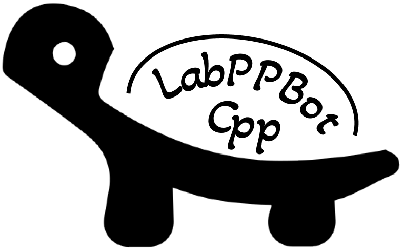

# LabPPBot_Server 

**LabPPBot_Server는 카카오톡 메신저에서 사용가능한 자동화 봇 클라이언트인 [LapPPBot_Cpp](https://github.com/changdae20/LabPPBot_Cpp)에서 사용하는 REST API 서버입니다.**

# Dependencies
* [npm](https://www.npmjs.com/)
* [nodemon](https://www.npmjs.com/package/nodemon)

더 많은 dependency는 [package.json](package.json) 및 [package-lock.json](package-lock.json)을 참고하세요.

# TODOs
* 민감한 정보 및 코드 암호화 및 추상화 (현재는 관련 코드들을 아예 지워둔 상태로 GitHub 업로드)

# License

**The MIT License (MIT)**

**Copyright (c) 2021 changdae20.**
